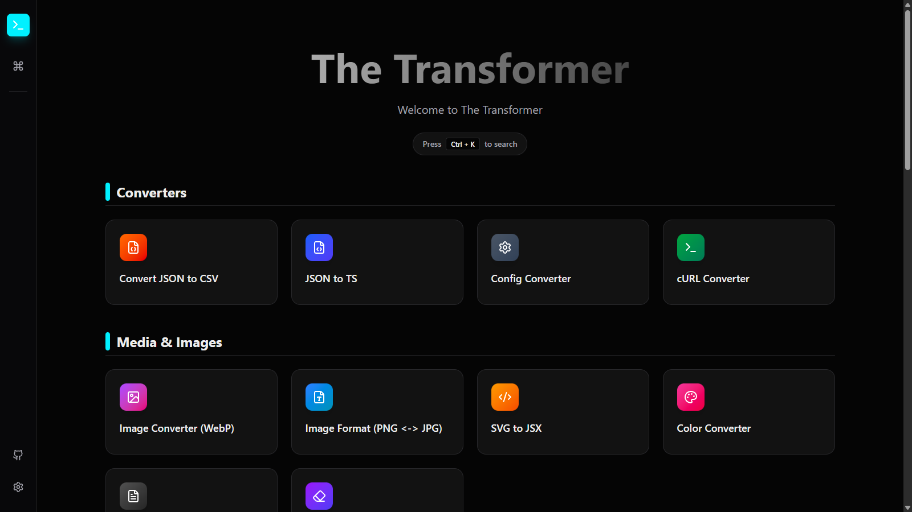

# The Transformer ⚡


## 🌐 The Problem

Developers and web enthusiasts often need quick tools (JWT decoding, image conversion, metadata removal) but face two major risks:

1.  **Privacy:** Most online tools upload your sensitive data (API keys, personal photos) to their servers.
2.  **Fragmentation:** You have to jump between 10 different bookmarked sites, each with different UI, ads, and cookies.

**The Transformer** solves this by providing a unified, professional, and **offline-first** suite where your data never leaves your device.

---

**The Transformer** is the ultimate, privacy-focused Swiss Army Knife for developers, designers, and webmasters.

It runs **100% locally** in your browser. No data is ever sent to a server. Whether you need to decode a JWT, remove an image background with AI, or generate secure keys—it happens instantly on your device.



## ✨ Why The Transformer?

- **🔒 Privacy First:** Your data (keys, images, passwords) never leaves your browser.
- **⚡ Blazing Fast:** Zero network latency. Built with Vite and WASM.
- **📦 Offline Capable:** Works without an internet connection (PWA).
- **🌍 Multi-language:** Fully localized in **8+ languages** (EN, TR, ES, FR, DE, IT, PT, RU).
- **🎨 Amazing UX:** System-wide dark mode, command palette (`Ctrl+K`), and a smart dashboard with **Favorites** and **Recent Tools**.

## 🚀 Key Features

### 🏢 Smart Dashboard

- **Favorites:** Pin your most-used tools to the top for instant access.
- **Recent Tools:** Automatically tracks your last-used utilities.
- **Category Navigation:** Intuitive grouping for rapid discovery.

### 🛠️ Developer Essentials

- **Code Tools:** Minifier & Beautifier for HTML, CSS, JS, and JSON.
- **JWT Tools:** Professional Decoder & Generator with advanced signature handling.
- **Converters:** JSON ↔ CSV/Excel, JSON ↔ YAML, XML ↔ JSON, Config & cURL.
- **Generators:** UUIDs, Hashes (MD5/SHA), Cron Expressions, Mock Data Generator.

### 🖼️ Media & AI Studio

- **AI Background Remover:** Remove backgrounds in-browser using advanced AI models.
- **Image Pro:** Converter (WebP/AVIF), Compressor (**Manual Quality & Format Selection**), Resizer & Cropper.
- **Image/PDF Utilities:** PDF ↔ Image, Image to PDF, SVG to JSX.
- **OCR:** AI-powered text extraction from images with local processing.
- **Privacy Suite:** EXIF Metadata Cleaner (GPS, device info, and sensor data removal).

### 🌐 Network & Web Tools

- **Professional Speed Test:** Real-time **Download, Ping, and Jitter** analysis with local measurement.
- **SEO & Web:** Meta Tag Generator, Robots.txt & Sitemap creator, Page Speed Checklist, and SEO Previews.
- **IP Info:** Detailed geolocation and network information lookup.

### 🔒 Security & CSS Systems

- **Secrets & Keys:** Cryptographically secure **Password, API Key, and CSRF Token** generators.
- **CSS Engines:** Glassmorphism, Neumorphism, Box Shadow & Gradient generators with live code export.
- **Typography & Layout:** Fluid Typography (Clamp) & Font Pairing design toolkit.
- **Analysis Tools:** Email Header Analyzer, User-Agent Parser, and Browser Fingerprinting.

## 📦 Tech Stack

- **Core:** [React 19](https://react.dev/), [TypeScript](https://www.typescriptlang.org/), [Vite 6](https://vitejs.dev/)
- **Styling:** [Tailwind CSS v4](https://tailwindcss.com/)
- **Icons:** [Lucide React](https://lucide.dev/)
- **PWA:** `vite-plugin-pwa` for full offline support.
- **Key Libraries:** `i18next`, `@imgly/background-removal`, `tesseract.js`, `pdf-lib`, `papaparse`

## 🏃‍♂️ Quick Start

```bash
# Install dependencies
npm install

# Run locally
npm run dev

# Build for production
npm run build
```

## 📜 License

Distributed under the MIT License. See `LICENSE` for more information.

---

<p align="center">
  Built with ❤️ by <a href="https://github.com/BilalisTheBack">BilalisTheBack</a>
</p>
