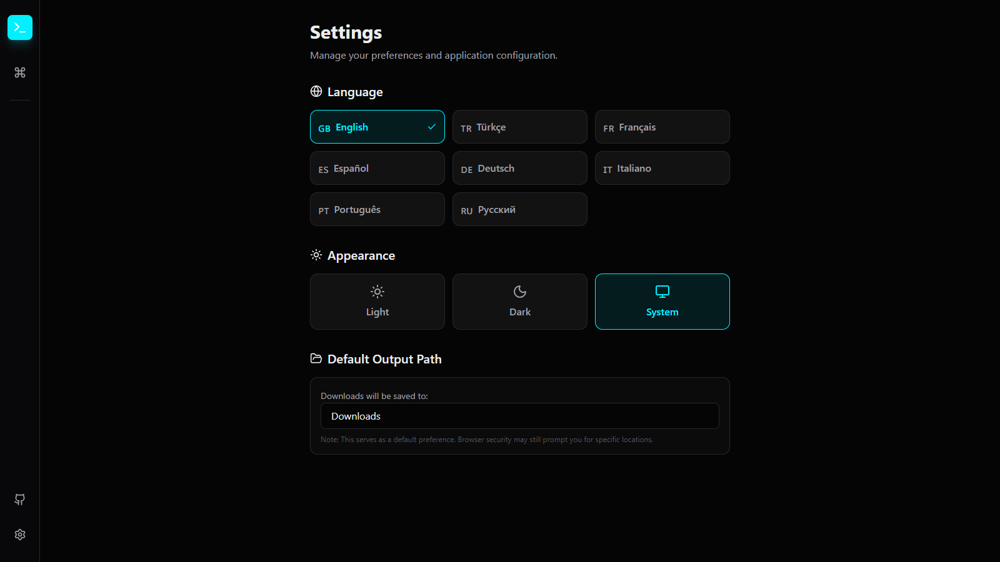

# The Transformer

**The Transformer** is an extensive, offline-capable developer utility suite built with **React, Vite, and TypeScript**. It provides a unified interface for over 25+ essential tools ranging from data conversion to security generation, media processing, and text analysis.

## 📸 Screenshots

<table>
  <tr>
    <td align="center">
      
      <br />
      <strong>Main Dashboard</strong>
    </td>
    <td align="center">
      
      <br />
      <strong>Command Palette (Ctrl+K)</strong>
    </td>
  </tr>
  <tr>
    <td align="center" colspan="2">
      
      <br />
      <strong>Settings & Preferences</strong>
    </td>
  </tr>
</table>

## 🚀 Features

The application is categorized into intuitive modules:

### 🔄 Data & Converters

- **JSON <-> CSV/Excel**: Convert data formats instantly with preview and download.
- **JSON -> TypeScript**: Generate TS interfaces from JSON objects.
- **cURL Converter**: Convert cURL commands to Fetch, Axios, or Python requests.
- **Config Converter**: Switch between JSON, YAML, and TOML.

### 🖼️ Media Tools

- **Image Converter**: Bulk convert PNG/JPG to modern WebP/AVIF formats.
- **AI Background Remover**: Remove backgrounds from images using local AI (browser-based, no API required).
- **SVG -> JSX**: Transform SVG code into React components.
- **Color Converter**: HEX, RGB, HSL conversions with a visual palette generator.
- **OCR**: Extract text from images with multi-language support (EN, TR, FR, DE, ES). Supports drag-and-drop and paste.
- **Image Format**: Convert between PNG and JPG.
- **Image Compressor**: Reduce file size with quality control.
- **Image Cropper**: Crop and resize images with aspect ratio presets.
- **Exif Cleaner**: Remove sensitive metadata (GPS, device info) for privacy.
- **PDF Utils**: Convert Images to PDF and PDF pages back to Images.

### 🛠️ Developer Tools

- **JWT Decoder**: Debug JSON Web Tokens without sending data to a server.
- **Base64**: Encode and decode strings or files.
- **Epoch Converter**: Human-readable date <-> Unix timestamp conversion.
- **JSON <-> YAML**: Seamless bidirectional conversion.
- **SQL Formatter**: Prettify and minify SQL queries.
- **Metadata Viewer**: Deep dive into file headers and EXIF/ID3 tags.
- **HTTP/User-Agent**: Look up HTTP status codes and parse complex User-Agent strings.
- **Generators**: Build Cron expressions, Environment variables, and Mock JSON data.

### 🔐 Security & Encryption

- **Hash Generator**: MD5, SHA-256, SHA-512 hashing.
- **UUID/Key Gen**: Generate random GUIDs, CSRF tokens, and secure encryption keys.
- **URL Encoder**: Standard Encode/Decode utilities.
- **Privacy Tools**: Browser fingerprinting analysis and Email header analysis.
- **Password Suite**: Generate secure passwords and check their strength against complex patterns.
- **JWT Generator**: Create custom JWTs with various algorithms.

### 📝 Text & Code

- **Markdown Preview**: Live Markdown to HTML conversion.
- **Diff Viewer**: Side-by-side text comparison.
- **Log Analyzer**: Highlight and filter log files (Error/Warn/Info).
- **Lorem Ipsum**: Generate customizable dummy text.

### 🎨 Visual & CSS

- **QR Code Generator**: Create QR codes for text/URLs.
- **Box Shadow**: Visually design CSS box-shadows.
- **CSS Generators**: Build Gradients, Glassmorphism, Neumorphism, and CSS Clamp rules.
- **Typography**: Font pairing tool for modern web design.

### 🔍 SEO & Web

- **Meta Tag Gen**: Generate and preview social media meta tags (Open Graph, Twitter).
- **Search Engine Utils**: Generate `robots.txt` and `sitemap.xml` files.
- **Performance**: Page Speed Checklist for optimization.
- **SEO Preview**: Live preview of search results (SERP) snippet.

## 🌟 Key Highlights

- **Offline First**: All processing happens in the browser. No data is sent to any server.
- **Drag & Drop**: Universal drag-and-drop support. Drop a file anywhere to automatically open the correct tool.
- **Command Palette**: Press `Ctrl+K` (or `Cmd+K`) to quickly search and jump to any tool.
- **Internationalization**: Fully translated into **8 languages** (English, Turkish, French, Spanish, German, Italian, Portuguese, Russian).
- **Dark Mode**: System-aware theme switching (Light/Dark).

## 🛠️ Technology Stack

The application is built using a modern, robust, and completely offline-capable stack:

### 🏗️ Core

- **React 19**: Latest UI library for building interactive interfaces.
- **Vite**: Next-generation frontend tooling for lightning-fast builds.
- **TypeScript**: Strictly typed JavaScript for scalable development.

### 🎨 Styling & UI

- **Tailwind CSS v4**: Utility-first CSS framework.
- **Lucide React**: Beautiful, consistent icon set.
- **Framer Motion**: Production-ready animation library.
- **React Router v7**: Declarative routing.

### 📚 Libraries & Tools

- **Data**: `papaparse` (CSV), `xlsx` (Excel), `js-yaml`, `smol-toml`.
- **Media**: `@imgly/background-removal` (AI Background Removal), `tesseract.js` (OCR), `exifreader` (Metadata), `pdf-lib` (PDF edition), `qrcode`.
- **Utilities**: `i18next` (Internationalization), `date-fns`, `uuid`, `sql-formatter`.

## 📦 Installation & Running

1.  **Clone the repository**:

    ```bash
    git clone https://github.com/BilalisTheBack/transformer.git
    cd transformer
    ```

2.  **Install dependencies**:

    ```bash
    npm install
    ```

3.  **Start Development Server**:

    ```bash
    npm run dev
    ```

4.  **Build for Production**:
    ```bash
    npm run build
    ```

## 🤝 Contribution

Feel free to open issues or PRs for new tool suggestions!

---

_Built with for developers by [BilalisTheBack](https://github.com/BilalisTheBack)._
